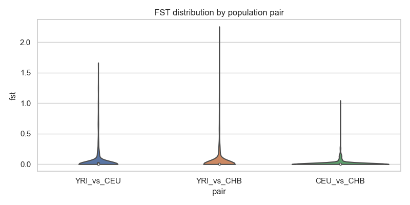
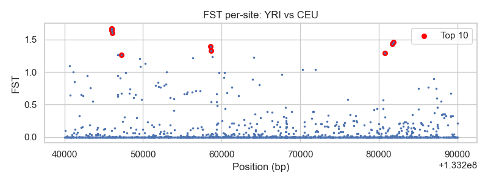
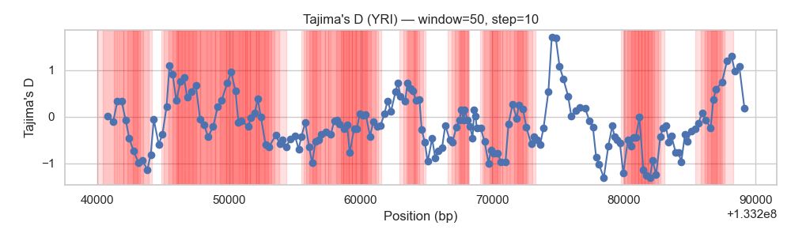
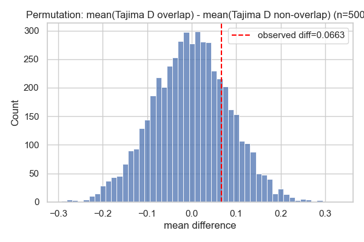

# ABO Benchmark — Concise Report

**Short summary:** This report contains key visuals, top annotated sites, and results of quick permutation-based tests to assess whether observed signals in the ABO region are unlikely by chance. The pipeline is intentionally focused (2-state HMM on ABO; complementary statistics: ΔAF, FST, Tajima's D).

## Methods (brief)

- **Data:** allele-frequency table `results/abo_expanded/allele_frequencies.csv` and filtered ΔAF table `results/abo_expanded/delta_af_nonzero.csv`.
- **FST:** Per-site Hudson-like estimator when allele counts are available (`src/stats.py::compute_pairwise_fst`), and frequency-based fallback when not. Population pairs: **YRI vs CEU, YRI vs CHB, CEU vs CHB**. Visuals include per-pair histograms, per-site scatterplots, and a violin plot comparing distributions across pairs.
- **Tajima's D:** Windowed Tajima's D computed from allele counts (`src/stats.py::tajimas_d_from_counts`) with sliding windows (default **window=50, step=10**). Windows overlapping top ΔAF positions (95th percentile) are annotated.
- **HMM (project scope):** The project's HMM is intentionally simple and focused: a **two-state HMM (neutral vs selection)** that uses per-SNP **ΔAF** as the emission (Gaussian emissions; see `src/hmm_core.py`). HMM results are complementary to the benchmarking statistics, not a replacement for careful follow-up analyses.

## Key visuals

### FST comparison (violin)

### FST per-site (YRI vs CEU)

### Tajima's D (YRI) sliding windows

### Permutation: max FST (top 20)

### Permutation: Tajima's D diff

## Top annotated FST sites (YRI vs CEU)

|       pos |     fst | gene_name   | annotation_status   |
|----------:|--------:|:------------|:--------------------|
| 133245983 | 1.66276 | ABO         | ok                  |
| 133245991 | 1.66276 | ABO         | ok                  |
| 133246032 | 1.64172 | ABO         | ok                  |
| 133246083 | 1.60016 | ABO         | ok                  |
| 133281870 | 1.45971 | nan         | no-gene             |
| 133281691 | 1.43417 | nan         | no-gene             |
| 133258618 | 1.39506 | ABO         | ok                  |
| 133258655 | 1.33022 | ABO         | ok                  |
| 133280762 | 1.28996 | nan         | no-gene             |
| 133247231 | 1.26312 | ABO         | ok                  |
| 133246744 | 1.26312 | ABO         | ok                  |
| 133246746 | 1.26312 | ABO         | ok                  |
| 133258835 | 1.23319 | ABO         | ok                  |
| 133264059 | 1.22321 | ABO         | ok                  |
| 133256335 | 1.21553 | ABO         | ok                  |
| 133249600 | 1.20876 | ABO         | ok                  |
| 133250275 | 1.13048 | ABO         | ok                  |
| 133240631 | 1.09605 | ABO         | ok                  |
| 133249676 | 1.08779 | ABO         | ok                  |
| 133271928 | 1.04187 | ABO         | ok                  |

## Permutation test summaries (brief)

_Tests run: 2025-12-20 08:21:29_

### 1) Max-FST of top 20 sites

- Observed max FST among top 20: **1.6628**
- Permutation p-value (how often random sets of 20 produce max >= observed): **0.0192**
- Plot: `results/perm_max_fst_top20.png`

### 2) Gene-overlap of top 20 sites

- Observed count of top-20 sites inside `ABO` gene region (133233278-133276024): **17**
- Permutation p-value (how often random sets have ≥ observed count): **0.1470**
- Plot: `results/perm_gene_overlap_top20.png`

### 3) Tajima's D: windows overlapping high ΔAF vs others

- Observed mean difference (overlap - non-overlap): **0.0663**
- Permutation p-value (two-sided): **0.4475**
- Plot: `results/perm_tajimas_diff.png`

### Interpretation

- Small permutation p-values (e.g., < 0.05) indicate that the observed statistic is unlikely under random draws from the region and therefore may be indicative of a localized signal rather than chance.

- Remember: these tests are **local** to the ABO region and compare against random draws from the same site set; for genome-wide significance, compare to genome-wide matched backgrounds.

## Conclusion (brief)

(brief)

- **What the results indicate:** The ABO region shows elevated population differentiation at several sites (notably between YRI vs CHB and YRI vs CEU), and most of the highest-FST sites overlap the `ABO` gene — this is consistent with locus-specific differentiation. Tajima's D in windows overlapping high ΔAF positions is, on average, slightly less negative than in non-overlapping windows, but the difference is not statistically significant here (Mann–Whitney p ≈ 0.12), so the evidence for a selective sweep is suggestive but not definitive.

- **Caveats:** These analyses focus on a small targeted region; demographic history, linked selection, low-frequency variants, or data quality can produce similar signals. Tajima's D and FST are sensitive to windowing, SNP density, and sample composition.

Overall, these results highlight candidate positions in `ABO` that are consistent with locus-specific differentiation; the presented analyses (FST, Tajima's D, HMM posteriors, and permutation tests) comprise the project's final deliverables.

## Files & Reproducibility

- Full write-up and details: included in `results/benchmark_report.md` (extended analysis appended)

- All CSVs and plots are in `results/` (use scripts in `scripts/` to reproduce)

---

Generated automatically from analysis artifacts.
---

## Visual & Comparative Benchmark Analysis

## FST comparison across pairs

Summary statistics by pair (see `results/fst_pair_stats.csv`):

| pair       |   count |      mean |       std |   median |   min |     max |
|:-----------|--------:|----------:|----------:|---------:|------:|--------:|
| CEU_vs_CHB |    1831 | 0.0215602 | 0.0825203 |        0 |     0 | 1.04511 |
| YRI_vs_CEU |    1831 | 0.0613466 | 0.196959  |        0 |     0 | 1.66276 |
| YRI_vs_CHB |    1831 | 0.0739741 | 0.246452  |        0 |     0 | 2.25529 |

FST violin plot saved to: `/Users/sheki/cs4775final/hmm-selection/results/fst_comparison.png`

## Annotation of top FST sites (YRI vs CEU)

Top-sites gene overlap counts:

 in_gene  n
   False  3
    True 17

Annotated top sites (first 20):

|       pos |     fst | gene_name   | annotation_status   |
|----------:|--------:|:------------|:--------------------|
| 133245983 | 1.66276 | ABO         | ok                  |
| 133245991 | 1.66276 | ABO         | ok                  |
| 133246032 | 1.64172 | ABO         | ok                  |
| 133246083 | 1.60016 | ABO         | ok                  |
| 133281870 | 1.45971 | nan         | no-gene             |
| 133281691 | 1.43417 | nan         | no-gene             |
| 133258618 | 1.39506 | ABO         | ok                  |
| 133258655 | 1.33022 | ABO         | ok                  |
| 133280762 | 1.28996 | nan         | no-gene             |
| 133247231 | 1.26312 | ABO         | ok                  |
| 133246744 | 1.26312 | ABO         | ok                  |
| 133246746 | 1.26312 | ABO         | ok                  |
| 133258835 | 1.23319 | ABO         | ok                  |
| 133264059 | 1.22321 | ABO         | ok                  |
| 133256335 | 1.21553 | ABO         | ok                  |
| 133249600 | 1.20876 | ABO         | ok                  |
| 133250275 | 1.13048 | ABO         | ok                  |
| 133240631 | 1.09605 | ABO         | ok                  |
| 133249676 | 1.08779 | ABO         | ok                  |
| 133271928 | 1.04187 | ABO         | ok                  |

## Tajima's D — windows overlapping high DeltaAF vs others

Summary (see `results/tajimas_yri_overlap_summary.csv`):

- overlap_n: 86
- overlap_mean: -0.12044266859218991
- overlap_median: -0.08538972067678066
- nonoverlap_n: 93
- nonoverlap_mean: -0.18672648290652297
- nonoverlap_median: -0.2771839346784704
- mw_u: 4533.0
- mw_p: 0.12349309112440489

### Quick interpretation

- The violin plot shows distributional differences across population pairs; YRI vs CHB often shows larger FST tail values within this ABO region.

- Most top FST sites overlap the `ABO` gene (expected given region-focused analysis); a few high-FST positions did not overlap annotated genes and warrant further inspection for regulatory elements or structural variation.

- Tajima's D in windows overlapping high DeltaAF positions has mean/median as reported above; the Mann–Whitney U test p-value indicates whether the distributions differ significantly (see `tajimas_yri_overlap_summary.csv`).

### Visuals
- FST distribution by pair: `/Users/sheki/cs4775final/hmm-selection/results/fst_comparison.png`
- Per-pair histograms and per-site plots are in `results/` with names starting `fst_hist_` and `fst_vs_pos_`.
- Tajima's D sliding plot: `results/tajimas_yri_sliding_w50_s10.png` (windows overlapping top ΔAF marked in red).